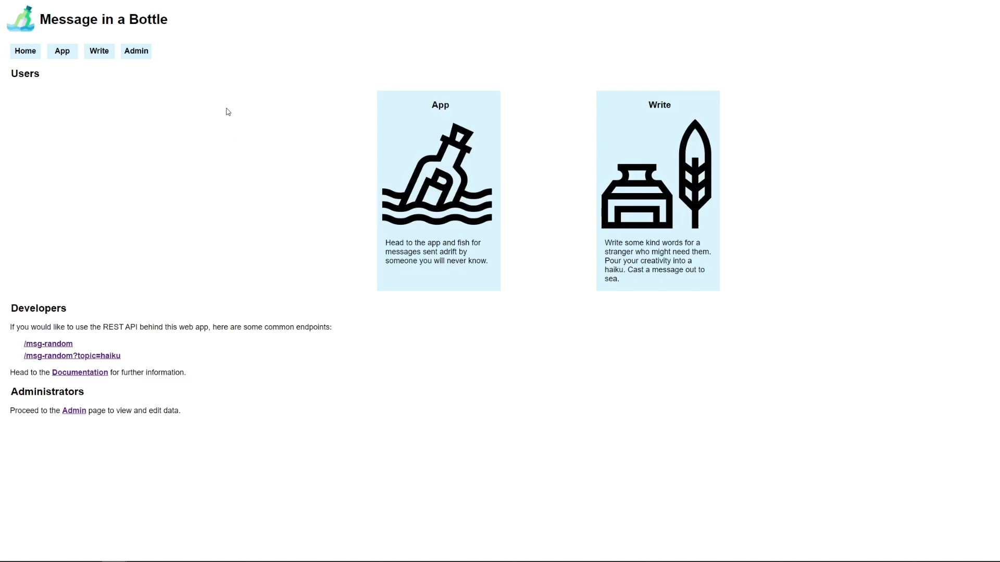

# Message in a Bottle

Web app &amp; API to send anonymous messages received by random recipients.

YouTube demo: https://www.youtube.com/watch?v=L_27KDfHmWY

[See Documentation](https://github.com/crlimacastro/Message-In-A-Bottle/blob/main/documentation.md)

